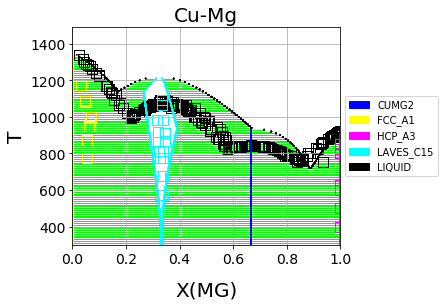
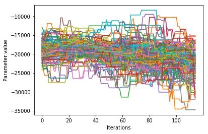
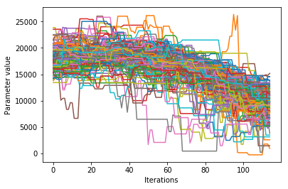

.. raw:: latex

   \chapter{Cu-Mg example}

.. _Cu-Mg Example:

=============
Cu-Mg Example
=============

The Cu-Mg binary system is an interesting and simple binary subsystem for light
metal alloys. It has been modeled in the literature by [Coughanowr1991]_,
[Zuo1993]_, and [Zhou2007]_ and was featured as a case study in
Computational Thermodynamics: The Calphad Method [Lukas2007]_.

Here we will combine density functional theory and experimental calculations of
single-phase data to generate a first-principles phase diagram. Then that
database will be used as a starting point for a Markov Chain Monte Carlo (MCMC)
Bayesian optimization of the parameters to fit zero-phase fraction data.

Input data
==========

All of the input data for ESPEI is stored in a public `ESPEI-datasets`_
repository on GitHub. The data in this repository is Creative Commons
Attribution 4.0 (CC-BY-4.0) licensed and may be used, commercialized or reused
freely.

In order to run ESPEI with the data in ESPEI-datasets, you should clone this
repository to your computer. Files referred to throughout this tutorial are
found in the `CU-MG` folder. The input files will be very breifly explained in
this tutorial so that you are able to know their use. A more detailed
description of the files is found on the :ref:`Input data` page.

If you make changes or additions, you are encouraged to share these back to the
ESPEI-datasets repository so that others may benefit from this data as you have.
You may then add your name to the CONTRIBUTORS file as described in the README.

Phases and CALPHAD models
=========================

The Cu-Mg system contains five stable phases: Liquid, disordered fcc and hcp,
the C15 Laves phase and the CuMg2 phase. All of these phases will be modeled as
solution phases, except for CuMg2, which will be represented as a stoichiometric
compound. The phase names and corresponding sublattice models are as follows::

    LIQUID:    (CU, MG)1
    FCC_A1:    (CU, MG)1 (VA)1
    HCP_A3:    (CU, MG)1 (VA)1
    LAVES_C15: (CU, MG)2 (CU, MG)1
    CUMG2:     (CU)1 (MG)2

These phase names and sublattice models are described in the JSON file
`Cu-Mg-input.json` file as seen below

.. code-block:: json

    {
      "components": ["CU", "MG", "VA"],
      "phases": {
             "LIQUID" : {
                "sublattice_model": [["CU", "MG"]],
                "sublattice_site_ratios": [1]
             },
             "CUMG2": {
                "sublattice_model": [["CU"], ["MG"]],
                "sublattice_site_ratios": [1, 2]
             },
             "FCC_A1": {
                "sublattice_model": [["CU", "MG"], ["VA"]],
                "sublattice_site_ratios": [1, 1]
             },
             "HCP_A3": {
                "sublattice_site_ratios": [1, 0.5],
                "sublattice_model": [["CU", "MG"], ["VA"]]
             },
             "LAVES_C15": {
                "sublattice_site_ratios": [2, 1],
                "sublattice_model": [["CU", "MG"], ["CU", "MG"]]
             }
        }
    }

ESPEI
=====

ESPEI has two types of fitting -- parameter generation and MCMC optimization.
The parameter generation step uses experimental and first-principles data of the
derivatives of the Gibbs free energy to parameterize the Gibbs energies of each
individual phase. The MCMC optimization step fits the generated parameters to
experimental phase equilibria data. These two fitting procedures can be used
together to fully assess a given system. For clarity, we will preform these
steps separately to fit Cu-Mg. The next two sections are devoted to describing
ESPEI's parameter generation and optimization.

Though it should be no problem for this case, since the data has already been
used, you should get in the habit of checking datasets before running ESPEI.
ESPEI has a tool to help find and report problems in your datasets. This is
automatically run when you load the datasets, but will fail on the first error.
Running the following commmand (assuming from here on that you are in the
``CU-MG`` folder from `ESPEI-datasets`_)::

    espei --check-datasets input-data

The benefit of the this approach is that all of the datasets will be checked and
reported at once. If there are any failures, a list of them will be reported
with the two main types of errors being ``JSONError``, for which you should read
the JSON section of :ref:`Input data`, or ``DatasetError``, which are related to
the validity of your datasets scientifically (maching conditions and values
shape, etc.). The ``DatasetError`` messages are designed to be clear, so please
open an `issue on GitHub <https://github.com/PhasesResearchLab/ESPEI/issues>`_
if there is any confusion.

First-principles phase diagram
==============================

By using the ``Cu-Mg-input.json`` phase description for the fit settings and
passing all of the input data in the ``input-data`` folder, we can first use
ESPEI to generate a phase diagram based on single-phase experimental and DFT
data. Currently all of the input datasets must be formation properties, and it
can be seen that the formation enthalpies are defined from DFT and experiments
for the Laves and CuMg2 phases. Mixing enthalpies are defined for the for the
fcc, hcp, and Laves phases from DFT and for liquid from experimental
measurements.

The following command will generate a database named ``cu-mg_dft.tdb`` with
parameters selected and fit by ESPEI::

    espei --input espei-in.yaml

where ``espei-in.yaml`` is a :ref:`ESPEI input file <Writing input files>` with
the following contents

.. code-block:: yaml

   system:
     phase_models: Cu-Mg-input.json
     datasets: input-data
   generate_parameters:
     excess_model: linear
     ref_state: SGTE91
   output:
     output_db: cu-mg_dft.tdb

The calculation should be relatively quick, on the order of a minute of runtime.
With the above command, only mininmal output (warnings) will be reported. You
can increase the verbosity to report info messages by setting the
``output.verbosity`` key to ``1`` or debug messages with ``2``.

With the following code, we can look at the generated phase diagram and compare
it to our data.

.. code-block:: python

    # First-principles phase diagram
    from pycalphad import Database, binplot, variables as v
    from espei.datasets import load_datasets, recursive_glob
    from espei.plot import dataplot
    import matplotlib.pyplot as plt

    # load the experimental and DFT datasets
    datasets = load_datasets(recursive_glob('input-data', '*.json'))

    # set up the pycalphad phase diagram calculation
    dbf = Database('cu-mg_dft.tdb')
    comps = ['CU', 'MG', 'VA']
    phases = ['LIQUID', 'FCC_A1', 'HCP_A3', 'CUMG2', 'LAVES_C15']
    conds = {v.P: 101325, v.T: (300, 1500, 10), v.X('MG'): (0, 1, 0.01)}

    # plot the phase diagram and data
    ax = binplot(dbf, comps, phases, conds)
    dataplot(comps, phases, conds, datasets, ax=ax)
    ax.figure.savefig('cu-mg_dft_phase_diagram.png')

Which should result in the following figure

    First-principles Cu-Mg phase diagram from the single-phase fitting in ESPEI

We can see that the phase diagram is already very reasonable compared to the
experimental points. The liquidus temperatures and the solubilities of the fcc
and Laves phases are the key differences between the equilibrium data and our
first-principles phase diagram. The next section will discuss using ESPEI to
optimize the parameters selected and calculated based on all the data.

MCMC optimization
=================

With the data in the CU-MG input data, ESPEI generated 18 parameters to fit. For
systems with more components, solution phases, and input data, may more
parameters could be required to describe the thermodynamics of the specific
system well. Because they describe Gibbs free energies, parameters in CALPHAD
models are highly correlated in both single-phase descriptions and for
describing equilibria between phases. For large systems, global numerical
optimization of many parameters simultaneously is computationally intractable.

To combat the problem of optimizing many paramters, ESPEI uses MCMC, a
stochastic optimzation method.

Now we will use our zero phase fraction equilibria data to optimize our
first-principles database with MCMC. The following command will take the
database we created in the single-phase parameter selection and perform a MCMC
optimization, creating a ``cu-mg_mcmc.tdb``::

    espei --input espei-in.yaml

where ``espei-in.yaml`` is an :ref:`ESPEI input file <Writing input files>` with
the following structure

.. code-block:: YAML

    system:
      phase_models: Cu-Mg-input.json
      datasets: input-data
    mcmc:
      iterations: 1000
      input_db: cu-mg_dft.tdb
    output:
      output_db: cu-mg_mcmc.tdb

ESPEI defaults to run 1000 iterations and depends on calculating equilibrium in
pycalphad several times for each iteration and the optimization is
compute-bound. Fortunately, MCMC optimzations are embarrasingly parallel and
ESPEI allows for parallelization using `dask <http://dask.pydata.org/>`_ or with
MPI using `mpi4py <http://mpi4py.scipy.org/>`_ (single-node only at the time of
writing - we are working on it).

Note that you may also see messages about convergence failures or about
droppping conditions. These refer to failures to calculate the log-probability
or in the pycalphad solver's equilibrium calculation. They are not detrimental
to the optimization accuracy, but overall optimization may be slower because
those parameter proposals will never be accepted (they return a log-probability of
:math:`-\infty`).

Finally, we can use the newly optimized database to plot the phase diagram

.. code-block:: python

    # Optimized phase diagram from ESPEI's MCMC fitting
    from pycalphad import Database, binplot, variables as v
    from espei.datasets import load_datasets, recursive_glob
    from espei.plot import dataplot
    import matplotlib.pyplot as plt

    # load the experimental and DFT datasets
    datasets = load_datasets(recursive_glob('input-data', '*.json'))

    # set up the pycalphad phase diagram calculation
    dbf = Database('cu-mg_mcmc.tdb')
    comps = ['CU', 'MG', 'VA']
    phases = ['LIQUID', 'FCC_A1', 'HCP_A3', 'CUMG2', 'LAVES_C15']
    conds = {v.P: 101325, v.T: (300, 1500, 10), v.X('MG'): (0, 1, 0.01)}

    # plot the phase diagram and data
    ax = binplot(dbf, comps, phases, conds)
    dataplot(comps, phases, conds, datasets, ax=ax)
    ax.figure.savefig('cu-mg_mcmc_phase_diagram.png')

.. figure:: _static/cu-mg-mcmc-phase-diagram.png
    :alt: Cu-Mg phase diagram after 1000 MCMC iterations
    :scale: 100%

    Optimized Cu-Mg phase diagram from the MCMC fitting in ESPEI

Analyzing ESPEI Results
=======================

After finishing a MCMC run, you will want to analyze your results.

All of the MCMC results will be maintained in two output files, which
are serialized NumPy arrays. The file names are set in your
``espei-in.yaml`` file. The filenames are set by ``output.tracefile``
and ``output.probfile``
(`documentation <http://espei.org/en/latest/writing_input.html#tracefile>`__)
and the defaults are ``trace.npy`` and ``lnprob.npy``, respectively.

The ``tracefile`` contains all of the parameters that were proposed over
all chains and iterations (the trace). The ``probfile`` contains all of
calculated log probabilities for all chains and iterations (as negative
numbers, by convention).

There are several aspects of your data that you may wish to analyze. The
next sections will explore some of the options.

Probability convergence
-----------------------

First we'll plot how the probability changes for all of the chains as a
function of iterations. This gives a qualitative view of convergence.
There are several quantitative metrics that we won't explore here, such
as autocorrelation. Qualitatively, this run does not appear converged
after 115 iterations.

.. code:: python

    # remove next line if not using iPython or Juypter Notebooks
    %matplotlib inline
    import matplotlib.pyplot as plt
    import numpy as np
    from espei.analysis import truncate_arrays

    trace = np.load('trace.npy')
    lnprob = np.load('lnprob.npy')

    trace, lnprob = truncate_arrays(trace, lnprob)

    ax = plt.gca()
    ax.set_yscale('log')
    ax.set_ylim(1e7, 1e10)
    ax.set_xlabel('Iterations')
    ax.set_ylabel('- lnprob')
    num_chains = lnprob.shape[0]
    for i in range(num_chains):
        ax.plot(-lnprob[i,:])
    plt.show()

.. image:: _static/docs-analysis-example_1_0.png

Visualizing the trace of each parameter
---------------------------------------

We would like to see how each parameter changed during the iterations.
For brevity in the number of plots we'll plot all the chains for each
parameter on the same plot. Here we are looking to see how the
parameters explore the space and converge to a solution.

.. code:: python

    # remove next line if not using iPython or Juypter Notebooks
    %matplotlib inline
    import matplotlib.pyplot as plt
    import numpy as np

    from espei.analysis import truncate_arrays

    trace = np.load('trace.npy')
    lnprob = np.load('lnprob.npy')

    trace, lnprob = truncate_arrays(trace, lnprob)

    num_chains = trace.shape[0]
    num_parameters = 3 # only plot the first three parameter, for all of them use `trace.shape[2]`
    for parameter in range(num_parameters):
        ax = plt.figure().gca()
        ax.set_xlabel('Iterations')
        ax.set_ylabel('Parameter value')
        for chain in range(num_chains):
            ax.plot(trace[chain, :, parameter])
    plt.show()

.. image:: _static/docs-analysis-example_3_0.png

Corner plots
------------

Note: You must install the ``corner`` package before using it
(``conda install corner`` or ``pip install corner``).

In a corner plot, the distributions for each parameter are plotted along
the diagonal and covariances between them under the diagonal. A more
circular covariance means that parameters are not correlated to each
other, while elongated shapes indicate that the two parameters are
correlated. Strongly correlated parameters are expected for some
parameters in CALPHAD models within phases or for phases in equilibrium,
because increasing one parameter while decreasing another would give a
similar error.

.. code:: python

    # remove next line if not using iPython or Juypter Notebooks
    %matplotlib inline
    import matplotlib.pyplot as plt
    import numpy as np
    import corner

    from espei.analysis import truncate_arrays

    trace = np.load('trace.npy')
    lnprob = np.load('lnprob.npy')

    trace, lnprob = truncate_arrays(trace, lnprob)

    # flatten the along the first dimension containing all the chains in parallel
    fig = corner.corner(trace.reshape(-1, trace.shape[-1]))
    plt.show()

.. image:: _static/docs-analysis-example_5_0.png

Ultimately, there are many features to explore and we have only covered
a few basics. Since all of the results are stored as arrays, you are
free to analyze using whatever methods are relevant.

Summary
=======

ESPEI allows thermodynamic databases to be easily
reoptimized with little user interaction, so more data can be added later and
the database reoptimized at the cost of only computer time. In fact, the
existing database from estimates can be used as a starting point, rather than
one directly from first-principles, and the database can simply be modified to
match any new data.

Acknowledgements
================

Credit for initially preparing the datasets goes to Aleksei Egorov.

.. _ESPEI-datasets: https://github.com/phasesresearchlab/espei-datasets
