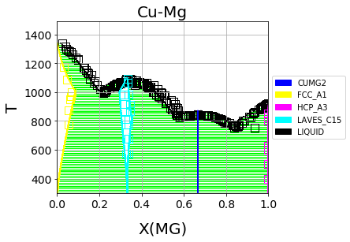

============
|logo| ESPEI
============

.. raw:: latex

   \part{Introduction}

.. toctree::
   :maxdepth: 1

   self
   installation
   quickstart
   CHANGES

ESPEI, or Extensible Self-optimizing Phase Equilibria Infrastructure, is a tool for thermodynamic database development within the CALPHAD method. It uses `pycalphad`_ for calculating Gibbs free energies of thermodynamic models.

What is ESPEI?
--------------

1. ESPEI parameterizes CALPHAD models with enthalpy, entropy, and heat capacity data using the corrected Akiake Information Criterion (AICc). This parameter generation step augments the CALPHAD modeler by providing tools for data-driven model selection, rather than relying on a modeler's intuition alone.
2. ESPEI optimizes CALPHAD model parameters to thermochemical and phase boundary data and quantifies the uncertainty of the model parameters using Markov Chain Monte Carlo (MCMC). This is similar to the PARROT module of Thermo-Calc, but goes beyond by adjusting all parameters simultaneously and evaluating parameter uncertainty.

Details on the implementation of ESPEI can be found in the publication: B. Bocklund *et al.*, MRS Communications 9(2) (2019) 1–10. doi:`10.1557/mrc.2019.59 <https://doi.org/10.1557/mrc.2019.59>`_.

What ESPEI can do?
------------------

ESPEI can be used to generate model parameters for CALPHAD models of the Gibbs energy that follow the temperature-dependent polynomial by Dinsdale (CALPHAD 15(4) 1991 317-425) within the compound energy formalism (CEF) for endmembers and Redlich-Kister-Mugganu excess mixing parameters in unary, binary and ternary systems.

All thermodynamic quantities are computed by pycalphad. The MCMC-based Bayesian parameter estimation can optimize data for any model that is supported by pycalphad, including models beyond the endmember Gibbs energies Redlich-Kister-Mugganiu excess terms, such as parameters in the ionic liquid model, magnetic, or two-state models. Performing Bayesian parameter estimation for arbitrary multicomponent thermodynamic data is supported.

Goals
-----

1. Offer a free and open-source tool for users to develop multicomponent databases with quantified uncertainty
2. Enable development of CALPHAD-type models for Gibbs energy, thermodynamic or kinetic properties
3. Provide a platform to build and apply novel model selection, optimization, and uncertainty quantification methods

The implementation for ESPEI involves first performing parameter generation by calculating parameters in thermodynamic models that are linearly described by :ref:`non-equilibrium thermochemical data <non_equilibrium_thermochemical_data>`.
Then Markov Chain Monte Carlo (MCMC) is used to optimize the candidate models from the parameter generation to :ref:`phase boundary data <phase_boundary_data>`.

    Cu-Mg phase diagram from a database created with and optimized by ESPEI.
    See the :ref:`Cu-Mg Example`.

History
-------

The name ESPEI and early concept were developed by [Shang2010]_.
After developing `pycalphad`_, Richard Otis reimagined the concept and wrote
`pycalphad-fitting`_ (used in [Otis2016]_ and [Otis2017]_).
The modern verison of ESPEI described here was created by forking
`pycalphad-fitting`_. Implementation details can be found in [Bocklund2019]_.

Changelog
---------

See `what's new <CHANGES.html>`_!

Documentation
-------------

.. raw:: latex

   \part{Tutorials}

.. toctree::
   :maxdepth: 1
   :caption: Tutorials

   cu-mg-example

.. raw:: latex

   \part{How-to}

.. toctree::
   :maxdepth: 1
   :caption: How-to

   input_data
   specifying_priors
   howto_use_custom_unary
   advanced_schedulers

.. raw:: latex

   \part{Reference}

.. toctree::
   :maxdepth: 1
   :caption: Reference

   writing_input
   recipes
   api/modules

.. raw:: latex

   \part{Developer}

.. toctree::
   :maxdepth: 1
   :caption: Developer

   contributing
   design
   releasing

.. raw:: latex

   \part{Appendix}

.. raw:: latex

   \chapter{Appendices}

Getting Help
------------

For help on installing and using ESPEI, please join the `PhasesResearchLab/ESPEI Gitter room <https://gitter.im/PhasesResearchLab/ESPEI>`_.

Bugs and software issues should be reported on `GitHub <https://github.com/PhasesResearchLab/ESPEI/issues>`_.

License
-------

ESPEI is MIT licensed.

::

   The MIT License (MIT)

   Copyright (c) 2015-2018 Richard Otis
   Copyright (c) 2017-2018 Brandon Bocklund
   Copyright (c) 2018-2019 Materials Genome Foundation

   Permission is hereby granted, free of charge, to any person obtaining a copy
   of this software and associated documentation files (the "Software"), to deal
   in the Software without restriction, including without limitation the rights
   to use, copy, modify, merge, publish, distribute, sublicense, and/or sell
   copies of the Software, and to permit persons to whom the Software is
   furnished to do so, subject to the following conditions:

   The above copyright notice and this permission notice shall be included in all
   copies or substantial portions of the Software.

   THE SOFTWARE IS PROVIDED "AS IS", WITHOUT WARRANTY OF ANY KIND, EXPRESS OR
   IMPLIED, INCLUDING BUT NOT LIMITED TO THE WARRANTIES OF MERCHANTABILITY,
   FITNESS FOR A PARTICULAR PURPOSE AND NONINFRINGEMENT. IN NO EVENT SHALL THE
   AUTHORS OR COPYRIGHT HOLDERS BE LIABLE FOR ANY CLAIM, DAMAGES OR OTHER
   LIABILITY, WHETHER IN AN ACTION OF CONTRACT, TORT OR OTHERWISE, ARISING FROM,
   OUT OF OR IN CONNECTION WITH THE SOFTWARE OR THE USE OR OTHER DEALINGS IN THE
   SOFTWARE.

Citing ESPEI
------------

If you use ESPEI for work presented in a publication, we ask that you cite the following publication:

B. Bocklund, R. Otis, A. Egorov, A. Obaied, I. Roslyakova, Z.-K. Liu, ESPEI for efficient thermodynamic database development, modification, and uncertainty quantification: application to Cu–Mg, MRS Commun. (2019) 1–10. doi:`10.1557/mrc.2019.59 <https://doi.org/10.1557/mrc.2019.59>`_.

::

   @article{Bocklund2019ESPEI,
            archivePrefix = {arXiv},
            arxivId = {1902.01269},
            author = {Bocklund, Brandon and Otis, Richard and Egorov, Aleksei and Obaied, Abdulmonem and Roslyakova, Irina and Liu, Zi-Kui},
            doi = {10.1557/mrc.2019.59},
            eprint = {1902.01269},
            issn = {2159-6859},
            journal = {MRS Communications},
            month = {jun},
            pages = {1--10},
            title = {{ESPEI for efficient thermodynamic database development, modification, and uncertainty quantification: application to Cu–Mg}},
            year = {2019}
   }

.. only:: html

   Indices and tables
   ------------------

   * :ref:`genindex`
   * :ref:`modindex`
   * :ref:`search`

.. _pycalphad-fitting: https://github.com/richardotis/pycalphad-fitting
.. _pycalphad: http://pycalphad.org

References
----------

.. [Bocklund2019] Bocklund *et al.*, MRS Communications 9(2) (2019) 1–10. doi:`10.1557/mrc.2019.59 <https://doi.org/10.1557/mrc.2019.59>`_
.. [Coughanowr1991] Coughanowr *et al.*, Assessment of the Cu-Mg system. Zeitschrift f{ü}r Met. 82, 574–581 (1991).
.. [Dinsdale1991] Dinsdale, Calphad 15(4) (1991) 317-425, doi:`10.1016/0364-5916(91)90030-N <https://doi.org/10.1016/0364-5916(91)90030-N>`_
.. [Lukas2007] Lukas, Fries, and Sundman, Computational Thermodynamics: The Calphad Method. (Cambridge University Press, 2007). doi:`10.1017/CBO9780511804137 <https://doi.org/10.1017/CBO9780511804137>`_
.. [Otis2016] Otis, Ph.D. Dissertation, The Pennsylvania State University (2016). https://etda.libraries.psu.edu/catalog/s1784k73d
.. [Otis2017] Otis *et al.*, JOM 69 (2017) doi:`10.1007/s11837-017-2318-6 <http://doi.org/10.1007/s11837-017-2318-6>`_
.. [Roslyakova2016] Roslyakova *et al.*, Calphad 55 (2016) 165–180. doi:`10.1016/j.calphad.2016.09.001 <https://doi.org/10.1016/j.calphad.2016.09.001>`_
.. [Shang2010] Shang, Wang, and Liu, Magnes. Technol. 2010 617-622 (2010).
.. [Zhou2007] Zhou *et al.*, J. Phase Equilibria Diffus. 28, 158–166 (2007). doi:`10.1007/s11669-007-9022-0 <https://doi.org/10.1007/s11669-007-9022-0>`_
.. [Zuo1993] Zuo and Chang, Zeitschrift f{ü}r Met. 84, 662–667 (1993).
