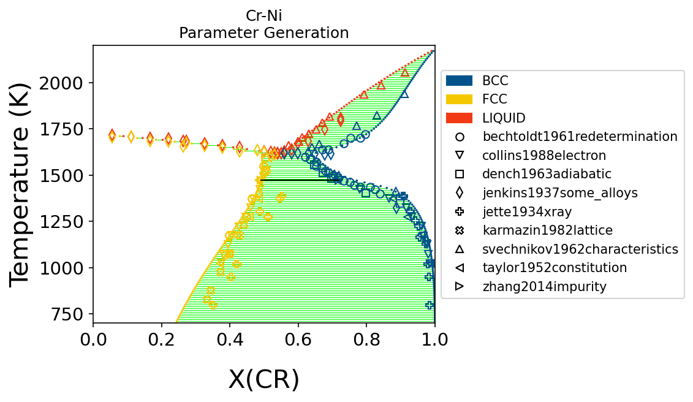
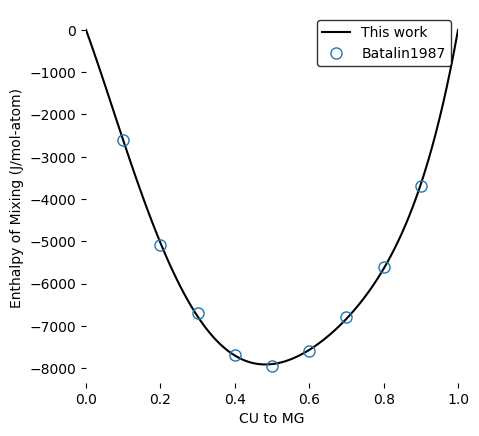
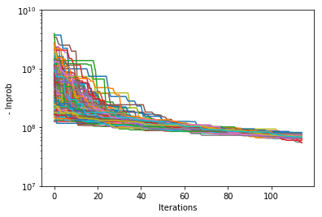
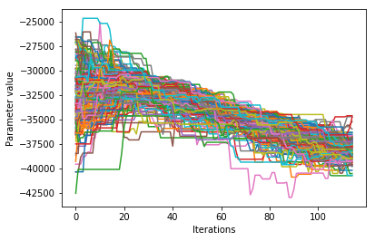
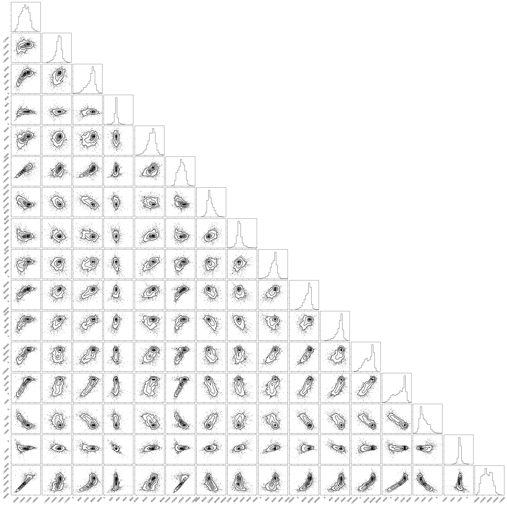
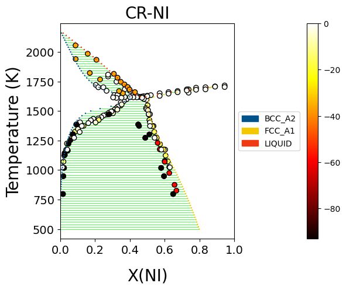

.. raw:: latex

   \chapter{Recipes}

.. _Recipes:

=======
Recipes
=======

Here you can find some useful snippets of code to make using ESPEI easier.

Get optimal parameter TDB files from a trace
============================================

Creating TDBs of optimal parameters from a tracefile and probfile:

.. code-block:: python

   """
   This script updates an input TDB file with the optimal parameters from an ESPEI run.

   Change the capitalized variables to your desired input and output filenames.
   """

   INPUT_TDB_FILENAME = 'CU-MG_param_gen.tdb'
   OUTPUT_TDB_FILENAME = 'CU-MG_opt_params.tdb'
   TRACE_FILENAME = 'trace.npy'
   LNPROB_FILENAME = 'lnprob.npy'

   import numpy as np
   from pycalphad import Database
   from espei.analysis import truncate_arrays
   from espei.utils import database_symbols_to_fit, optimal_parameters

   trace = np.load(TRACE_FILENAME)
   lnprob = np.load(LNPROB_FILENAME)
   trace, lnprob = truncate_arrays(trace, lnprob)

   dbf = Database(INPUT_TDB_FILENAME)
   opt_params = dict(zip(database_symbols_to_fit(dbf), optimal_parameters(trace, lnprob)))
   dbf.symbols.update(opt_params)
   dbf.to_file(OUTPUT_TDB_FILENAME)

Plot phase equilibria data
==========================

When compiling ESPEI datasets of phase equilibria data, it can be useful to plot the data to check that it matches visually with what you are expecting.
This script plots a binary phase diagram.

*TIP:* Using this in Jupyter Notebooks make it really fast to update and watch your progress.

.. code-block:: python

   """
   This script will create a plot in a couple seconds from a datasets directory
   that you can use to check your phase equilibria data.

   Change the capitalized variables to the system information and the
   directory of datasets you want to plot.
   """

   COMPONENTS = ['CU', 'MG', 'VA']
   INDEPENDENT_COMPONENT = "MG"  # component to plot on the x-axis
   PHASES = ['BCC_A2', 'CUMG2', 'FCC_A1', 'LAVES_C15', 'LIQUID']

   DATASETS_DIRECTORY = "~/my-datasets/CU-MG"

   X_MIN, X_MAX = 0.0, 1.0
   Y_MIN, Y_MAX = 400, 1400

   # script starts here, you shouldn't have to edit below this line
   import os
   from espei.plot import dataplot
   from espei.datasets import recursive_glob, load_datasets
   from pycalphad import variables as v
   import matplotlib.pyplot as plt

   plt.figure(figsize=(10,8))

   ds = load_datasets(recursive_glob(os.path.expanduser(DATASETS_DIRECTORY), '*.json'))
   conds = {v.P: 101325, v.T: (1,1,1), v.X(INDEPENDENT_COMPONENT): (1, 1, 1)}
   dataplot(COMPONENTS, PHASES, conds, ds)
   plt.xlim(X_MIN, X_MAX)
   plt.ylim(Y_MIN, Y_MAX)
   plt.show()

The script gives the following output:

.. figure:: _static/dataplot-recipe-cu-mg.png
    :alt: Cu-Mg dataplot recipe
    :width: 500pt

Plot phase diagram with data
============================

.. code-block:: python

   %matplotlib inline
   from pycalphad import Database, binplot, variables as v
   from espei.datasets import load_datasets, recursive_glob
   from espei.plot import dataplot
   import matplotlib.pyplot as plt

   # load the experimental and DFT datasets
   dataset_dir = "input-data"
   dataset_dir = "/Users/brandon/Projects/2020-workshop-material/ESPEI/input-data/run"
   datasets = load_datasets(recursive_glob(dataset_dir, "*.json"))

   # set up the pycalphad phase diagram calculation
   dbf = Database("/Users/brandon/Projects/2020-workshop-material/ESPEI/mcmc-tmp.tdb")
   comps = ["CR", "NI", "VA"]
   phases = ["LIQUID", "FCC", "BCC"]
   conds = {v.P: 101325, v.T: (700, 2200, 10), v.X("CR"): (0, 1, 0.01)}

   # plot the phase diagram and data
   fig = plt.figure(dpi=150)
   ax = fig.gca()
   binplot(dbf, comps, phases, conds, plot_kwargs={"ax": ax})
   dataplot(comps, phases, conds, datasets, ax=ax)
   ax.set_title("Cr-Ni\nParameter Generation")
   ax.set_ylim(conds[v.T][0], conds[v.T][1])
   ax.set_xlabel("X(CR)")
   ax.set_ylabel("Temperature (K)")
   fig.show()

Plot thermochemical properties parameters with data
===================================================

Parameter selection in ESPEI fits Calphad parameters to thermochemical data.
MCMC can adjust these parameters.
In both cases, it may be useful to compare the energies of specific
interactions to the model predictions. The
:py:func:`espei.plot.plot_interaction` code will plot the predicted
interaction from the database against the available data, if any.

.. code-block:: python

   """
   This script plots a single interaction in a database compared to data.
   """

   # Settings
   INPUT_TDB_FILENAME = 'CU-MG_param_gen.tdb'
   DATASET_DIRECTORY = 'input-data'
   PHASE_NAME = 'LIQUID'
   # CONFIGURATION must be a tuple of the configuration to be plotted.
   # This can only plot one endmember or interaction at a time.
   # Note that the outside tuples are the whole configuration
   # and the insides are for each individual sublattice.
   # Single sublattices *MUST* have the comma after the
   # object in order to be a tuple, not just parantheses.
   # some examples:
   # ('CU', 'MG')  # endmember
   # (('CU', 'MG'),)  # (('CU', 'MG')) is invalid because it will become ('CU', 'MG')
   # ('MG', ('CU', 'MG'))
   CONFIGURATION = (('CU', 'MG'),)

   # Plot the parameter
   import matplotlib.pyplot as plt
   from pycalphad import Database
   from espei.datasets import load_datasets, recursive_glob
   from espei.plot import plot_interaction

   dbf = Database(INPUT_TDB_FILENAME)
   comps = sorted(dbf.elements)
   ds = load_datasets(recursive_glob(DATASET_DIRECTORY, '*.json'))
   plot_interaction(dbf, comps, PHASE_NAME, CONFIGURATION, 'HM_MIX', datasets=ds)
   plt.show()

Running for the single sublattice LIQUID phase in Cu-Mg gives the following output after parameter selection:

Visualize probability convergence
=================================

Convergence can be qualitatively estimated by looking at how the
log-probability changes for all of the chains as a function of iterations.

.. code:: python

    # remove next line if not using iPython or Juypter Notebooks
    %matplotlib inline
    import matplotlib.pyplot as plt
    import numpy as np
    from espei.analysis import truncate_arrays

    trace = np.load('trace.npy')
    lnprob = np.load('lnprob.npy')

    trace, lnprob = truncate_arrays(trace, lnprob)

    ax = plt.gca()
    ax.set_yscale('log')
    ax.set_xlabel('Iterations')
    ax.set_ylabel('- lnprob')
    ax.plot(-lnprob.T)
    plt.show()

Visualize the trace of each parameter
=====================================

Looking at how each parameter chain evolves across the chains can show
if any particular chains are diverging from the rest, if there are
multiple modes being explored, or how wide the distribution of parameters
are relative to each other.

.. code:: python

    # remove next line if not using iPython or Juypter Notebooks
    %matplotlib inline
    import matplotlib.pyplot as plt
    import numpy as np

    from espei.analysis import truncate_arrays

    trace = np.load('trace.npy')
    lnprob = np.load('lnprob.npy')

    trace, lnprob = truncate_arrays(trace, lnprob)

    num_chains = trace.shape[0]
    num_parameters = trace.shape[2]
    for parameter in range(num_parameters):
        ax = plt.figure().gca()
        ax.set_xlabel('Iterations')
        ax.set_ylabel('Parameter value')
        ax.plot(trace[..., parameter].T)
    plt.show()

The example below is for *one* parameter. Running the snippet above will plot
all of the parameters on separate plots.

Plot a corner plot
==================

Note: You must install the ``corner`` package before using it
(``conda install corner`` or ``pip install corner``).

In a corner plot, the distributions for each parameter are plotted along
the diagonal and covariances between them under the diagonal. A more
circular covariance means that parameters are not correlated to each
other, while elongated shapes indicate that the two parameters are
correlated. Strongly correlated parameters are expected for some
parameters in CALPHAD models within phases or for phases in equilibrium,
because increasing one parameter while decreasing another would give a
similar likelihood.

.. code:: python

    # remove next line if not using iPython or Juypter Notebooks
    %matplotlib inline
    import matplotlib.pyplot as plt
    import numpy as np
    import corner

    from espei.analysis import truncate_arrays

    trace = np.load('trace.npy')
    lnprob = np.load('lnprob.npy')

    trace, lnprob = truncate_arrays(trace, lnprob)

    # flatten the along the first dimension containing all the chains in parallel
    fig = corner.corner(trace.reshape(-1, trace.shape[-1]))
    plt.show()

Plot ZPF driving forces
=======================
This visualization can be used as a diagnostic for understanding which ZPF data
are contributing the most driving force towards the likelihood. Note that these
driving forces are unweighted, since the weight is applied when computing the
log-likelihood of each driving force.

.. code:: python

   import numpy as np
   import matplotlib.pyplot as plt
   from pycalphad import Database, binplot, variables as v
   from pycalphad.core.utils import extract_parameters
   from espei.datasets import load_datasets, recursive_glob
   from espei.error_functions.zpf_error import get_zpf_data, calculate_zpf_driving_forces

   # User input variables
   TDB_PATH = 'mcmc.tdb'
   DATASETS_DIR = '../input-data'
   COMPS = ['CR', 'NI', 'VA']
   INDEP_COMP = v.X('NI')  # binary assumed
   CONDS = {v.N: 1, v.P: 101325, v.T: (500, 2200, 20), INDEP_COMP: (0, 1, 0.01)}
   CMAP = 'hot'
   outfile = 'driving-forces.png'
   parameters = {}  # e.g. {'VV0001': 10000.0}
   approximate_equilibrium = False

   # Script below:*
   dbf = Database(TDB_PATH)
   phases = list(dbf.phases.keys())

   # Get the datasets, construct ZPF data and compute driving forces
   # Driving forces and weights are ragged 2D arrays of shape (len(zpf_data), len(vertices in each zpf_data))
   ds = load_datasets(recursive_glob(DATASETS_DIR, '*.json'))
   zpf_data = get_zpf_data(dbf, COMPS, phases, ds, parameters=parameters)
   param_vec = extract_parameters(parameters)[1]
   driving_forces, weights = calculate_zpf_driving_forces(zpf_data, param_vec, approximate_equilibrium=approximate_equilibrium)

   # Construct the plotting compositions, temperatures and driving forces
   # Each should have len() == (number of vertices)
   # Driving forces already have the vertices unrolled so we can concatenate directly
   Xs = []
   Ts = []
   dfs = []
   for data, data_driving_forces in zip(zpf_data, driving_forces):
       for phase_region in data['phase_regions']:
           for vertex, df in zip(phase_region.vertices, data_driving_forces):
               comp_cond = vertex.comp_conds
               if vertex.has_missing_comp_cond:
                   # No composition to plot
                   continue
               dfs.append(df)
               Ts.append(phase_region.potential_conds[v.T])
               # Binary assumptions here
               assert len(comp_cond) == 1
               if INDEP_COMP in comp_cond:
                   Xs.append(comp_cond[INDEP_COMP])
               else:
                   # Switch the dependent and independent component
                   Xs.append(1.0 - tuple(comp_cond.values())[0])

   # Plot the phase diagram with driving forces
   fig = plt.figure(dpi=100)
   ax = fig.gca()
   binplot(dbf, COMPS, phases, CONDS, plot_kwargs={'ax': ax}, eq_kwargs={'parameters': parameters})
   sm = plt.cm.ScalarMappable(cmap=CMAP)
   sm.set_array(dfs)
   ax.scatter(Xs, Ts, c=dfs, cmap=CMAP, edgecolors='k')
   fig.colorbar(sm, ax=ax, pad=0.25)
   if outfile is not None:
       fig.savefig(outfile)
   else:
       fig.show()

