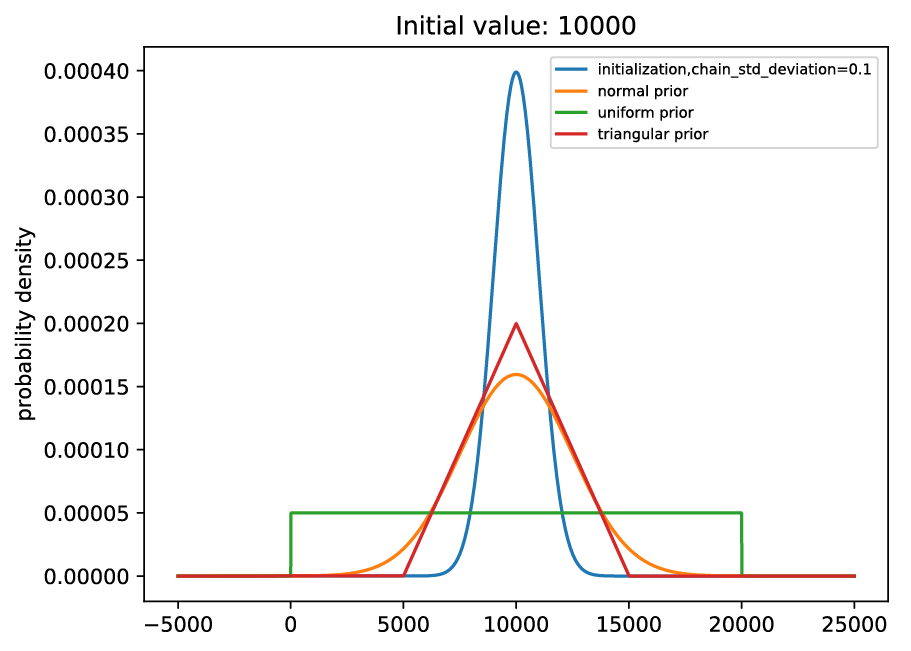

.. raw:: latex

   \chapter{Specifying Priors}

.. _Specifying Priors:

==================
Use Priors in MCMC
==================

In Bayesian statistics, data are used to update prior distributions for all parameters to calculate posterior distributions.
A basic introduction to priors and Bayesian statistics can be found in "Kruschke, J. (2014). Doing Bayesian data analysis: A tutorial with R, JAGS, and Stan. Academic Press.".
A more advanced treatment is given in "Gelman, A., Stern, H. S., Carlin, J. B., Dunson, D. B., Vehtari, A., & Rubin, D. B. (2013). Bayesian data analysis. Chapman and Hall/CRC.".

ESPEI provides a flexible interface to specify priors your want to use for a variety of parameters of different sign and magnitude through the ``espei.priors.PriorSpec`` class.
This section will cover how to

1. Define flexible, built-in priors using the YAML input and ESPEI script
2. Use custom priors programatically

Built-in Priors
===============

ESPEI has several built-in priors that correspond to functions in ``scipy.stats``: ``uniform``, ``normal``, and ``triangular``.
There is also a special (improper) ``zero`` prior that always gives :math:`\ln p = 0`, which is the default.

Each ``scipy.stats`` prior is typically specified using several keyword argument
parameters, e.g. ``loc`` and ``scale``, which have special meaning for the
different distribution functions.
In order to be flexible to specifying these arguments when the CALPHAD
parameters they will be used for are not known beforehand, ESPEI uses a small
language to specify how the distribution hyperparameters can be set relative to
the CALPHAD parameters.

Basically, the ``PriorSpec`` objects are created with the name of the distribution
and the hyperparameters that are modified with
one of the modifier types: ``absolute``, ``relative``, ``shift_absolute``, or ``shift_relative``.
For example, the ``loc`` parameter might become ``loc_relative`` and ``scale`` might
become ``scale_shift_relative``.

Here are some examples of how the modifier parameters of value ``v`` modify the hyperparameters when given a CALPHAD parameter of value ``p``:

* ``_absolute=v`` always take the exact value passed in, ``v``; ``loc_absolute=-20`` gives a value of ``loc=-20``.
* ``_relative=v`` gives , ``v*p``; ``scale_absolute=0.1`` with ``p=10000`` gives a value of ``scale=10000*0.1=1000``.
* ``_shift_absolute=v`` gives , ``p + v``; ``scale_shift_absolute=-10`` with ``p=10000`` gives a value of ``scale=10000+(-10)=9990``.
* ``_shift_relative=v`` gives , ``p + v*abs(p)``; ``loc_shift_relative=-0.5`` with ``p=-1000`` gives a value of ``loc=-1000+abs(-1000)*0.5=-1500``.

Note that the hyperparameter prefixes (``loc`` or ``scale``) are arbitrary and any hyperparameters used in the statistical distributions (e.g. ``c`` for the triangular distribution) could be used.

YAML
----

Prior can be specified in the YAML input as a list of dictionaries for different parameters.
Since Python objects cannot be instantiated in the YAML files, the ``PriorSpec`` can be described a dictionary of
``{'name': <<NAME>>, 'loc_relative': <<VALUE>>, 'scale_relative': <<VALUE>>, ...}``.

Some common examples in YAML format are as follows:

.. code-block:: YAML

   # normal prior, centered on parameter, standard deviation of 0.25*parameter
   prior:
     name: normal
     loc_relative: 1.0
     scale_relative: 0.25

   # uniform prior from 0 to 2*parameter (or negative(2*parameter) to 0)
   prior:
     name: uniform
     loc_shift_relative: -1.0
     scale_relative: 2.0

   # triangular prior, centered on parameter, from -0.5*parameter to 0.5*parameter
   prior:
     name: triangular
     loc_shift_relative: -0.5
     scale_relative: 1.0

Graphically, these are shown below:

    Example priors compared to initialized parameters.

As a side note: the priors in YAML files can be passed as Python dictionaries, e.g.:

.. code-block:: YAML

   # normal prior, centered on parameter, standard deviation of 0.25*parameter
   prior: {'name': 'normal', 'loc_relative': 1.0, 'scale_relative': 0.5}

Additionally, different priors can be specified using a list of prior specs that match the total degrees of freedom (VV-parameters) in the system.
For example, a two parameter system could use a normal and a triangular prior simultaneously:

.. code-block:: YAML

   # two priors:
   # first a normal prior, centered on parameter, standard deviation of 0.25*parameter
   # second a triangular prior, centered on parameter, from -0.5*parameter to 0.5*parameter
   prior: [{'name': 'normal', 'loc_relative': 1.0, 'scale_relative': 0.5}, {'name': 'triangular', 'loc_shift_relative': -0.5, 'scale_relative': 1.0}]

Custom Priors
=============

Generally speaking, a custom prior in ESPEI is any Python object that has a ``logpdf``
method that takes a parameter and returns the natural log of the probability
density function for that parameter. Any distribution you can create
using the functions in ``scipy.stats``, such as ``norm``, is valid.

A list of these custom priors can be passed to ESPEI similar to using built-in priors, but only from the Python interface (not YAML).
The number of priors must match the number of parameters, but you can also mix these with the ``PriorSpec`` objects as desired.

An example of fitting two parameters using a custom gamma distributions with minima at 10 and 100, respectively.

.. code-block:: python

   from scipy.stats import gamma

   my_priors = [gamma(a=1, loc=10), gamma(a=1, loc=100)]

   from espei.espei_script import get_run_settings, run_espei

   input_dict = {
       'system': {
           'phase_models': 'phases.json',
           'datasets': 'input-data',
       },
       'mcmc': {
           'iterations': '1000',
           'input_db': 'param_gen.tdb',  # must have two parameters to fit
           'prior': my_priors,
       },
   }

   run_espei(get_run_settings(input_dict))
